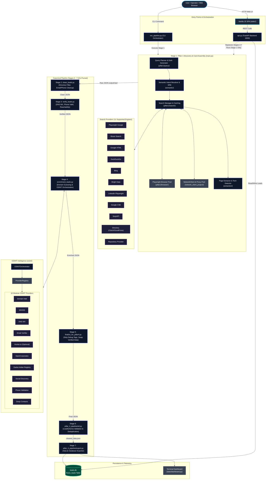
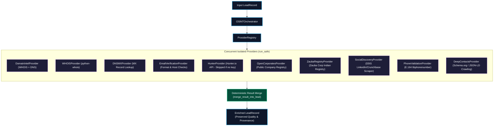
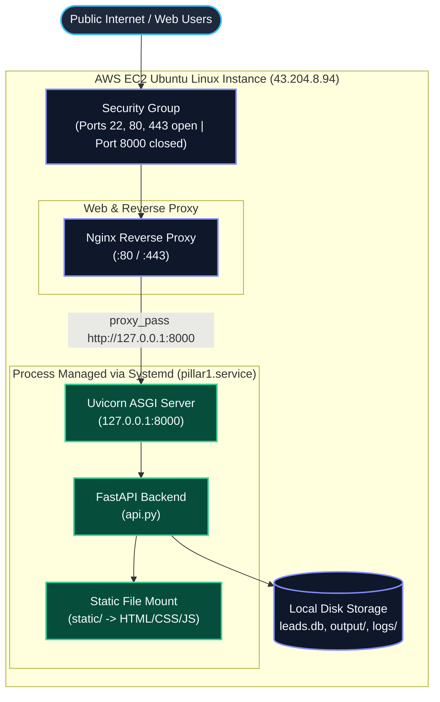

# Flowiz: Automated B2B Lead Intelligence & OSINT Pipeline

[](https://www.python.org/)
[](https://fastapi.tiangolo.com/)
[](https://playwright.dev/)
[](https://www.sqlite.org/)
[](LICENSE)
[](http://43.204.8.94/)

> **Flowiz** is an automated B2B lead intelligence and OSINT crawling pipeline designed to discover target companies, extract contact and corporate metadata, verify lead deliverability via DNS and network validation, enrich records using isolated OSINT providers, normalize entity schemas, and store validated leads in SQLite for downstream operational use.

*Live Application Deployment:* [http://43.204.8.94/](http://43.204.8.94/)  
*(Note: As documented in the [API vs. CLI Architecture](#6-important-api-vs-cli-architecture-note) section, the live web interface currently triggers a streamlined Pillar 1 extraction path, while the full 7-stage verification and enrichment workflow is executed via the canonical CLI orchestrator).*

---

## Table of Contents
- [1. Project Overview](#1-project-overview)
- [2. Key Features](#2-key-features)
- [3. Architecture](#3-architecture)
- [4. End-to-End Pipeline](#4-end-to-end-pipeline)
- [5. Important: API vs. CLI Architecture](#5-important-api-vs-cli-architecture)
- [6. Technology Stack](#6-technology-stack)
- [7. OSINT Architecture](#7-osint-architecture)
- [8. Data Flow](#8-data-flow)
- [9. Database Architecture](#9-database-architecture)
- [10. Security Hardening](#10-security-hardening)
- [11. Deployment Architecture](#11-deployment-architecture)
- [12. Local Setup & Quickstart](#12-local-setup--quickstart)
- [13. REST API Reference](#13-rest-api-reference)
- [14. Web Dashboard Frontend](#14-web-dashboard-frontend)
- [15. Repository Structure](#15-repository-structure)
- [16. Engineering Challenges Encountered](#16-engineering-challenges-encountered)
- [17. Known Issues & Audit Findings](#17-known-issues--audit-findings)
- [18. Remediation Roadmap](#18-remediation-roadmap)
- [19. Observability & Telemetry](#19-observability--telemetry)
- [20. Performance & Reliability](#20-performance--reliability)
- [21. Ethical & Responsible Crawling](#21-ethical--responsible-crawling)
- [22. Future Improvements](#22-future-improvements)
- [23. Conclusion](#23-conclusion)

---

## 1. Project Overview

Raw web searches for commercial leads often yield fragmented and noisy results: link aggregators, outdated blog posts, scraper directories, and unverified contacts. 

**Flowiz** bridges the gap between raw web search retrieval and actionable sales/intelligence data. Given a targeted keyword, entity name, or industry domain (e.g., `"AI companies in Noida"`, `"Fintech"`), the pipeline orchestrates an automated multi-stage funnel:

$$\text{Search Retrieval} \longrightarrow \text{Extraction} \longrightarrow \text{Cleaning} \longrightarrow \text{Verification} \longrightarrow \text{OSINT Enrichment} \longrightarrow \text{ETL} \longrightarrow \text{Database Persistence}$$

The platform combines:
- **Search-Engine Retrieval & Dynamic Dorking**: B2B intent query planning across 11 search providers.
- **Headless Browser Automation**: Chromium instance pool for JavaScript-heavy and bot-protected search endpoints.
- **Deep Website Crawling**: Multi-page traversal (home, about, contact, team) to extract emails, phone numbers, leadership roles, and JSON-LD schemas.
- **Semantic Filtering**: Domain intent resolution and relevance tiering (`HIGH`, `MEDIUM`, `LOW`, `REJECT`).
- **Network & Deliverability Verification**: Live DNS MX record checking, libphonenumber parsing, and SSRF-safe HTTP validation.
- **Modular OSINT Intelligence**: Isolated provider framework querying WHOIS, registries (OpenCorporates, Zauba), social discovery, and domain intelligence.
- **Deduplication & Canonical Persistence**: Domain-keyed single source of truth in SQLite (`flowiz_leads`), served via a FastAPI REST backend and a responsive single-page web dashboard.

---

## 2. Key Features

### Search & Discovery Intelligence
- **Multi-Provider Web Search**: Pluggable provider architecture supporting Playwright Google, Brave Search, Google HTML, DuckDuckGo, Bing, Bright Data SERP, LinkedIn Playwright, Google Custom Search Engine (CSE), SerpAPI, Directory Providers, and Repository Providers.
- **Query Planning & Dork Generation**: Dual-lane query planner dispatching identity-focused `DIRECT` queries for bare entities (e.g., `site:linkedin.com/company/swiggy`) and `EXPANDED` semantic queries for industry discovery.
- **Semantic Intent Resolution**: B2B ontology analysis resolving search concepts, target positions, services, and locations.
- **Relevance Ranking Engine**: Scored relevance tiering with adaptive weight learning from execution feedback.

### Crawling & Data Extraction
- **Deep Website Extraction**: Scrapes official homepages and linked subpages (`/contact`, `/about`, `/team`) for verified corporate contacts.
- **Structured Schema Ingestion**: Extracts JSON-LD schema objects (`Organization`, `LocalBusiness`, `Corporation`).
- **Contact Identification**: Regular-expression extraction of emails and telephone numbers paired with decision-maker scoring (Founder, CEO, VP, Director).
- **Technology Detection**: Pattern-based identification of tech stacks, frameworks, and CMS footprints.
- **Provenance Tracking**: Attribute-level provenance recording extraction source (e.g., `contact_page_text`, `homepage_mailto`, `search_snippet`).

### Verification & Deliverability
- **Live DNS MX Verification**: Resolves mail exchange records via `dnspython` to confirm active mail handling.
- **International Phone Parsing**: Formats and validates phone numbers against Google's `libphonenumber` standard.
- **HTTP Reachability Checks**: Confirms site responsiveness with short timeouts and SSL validation.
- **SSRF Redirection Guard**: Enforces private IPv4/IPv6 blocking, cloud metadata IP protection, and scheme restrictions.

### Modular OSINT Framework
- **Deterministic Orchestration**: Isolated execution across 10 modular OSINT providers with individual failure boundaries (`run_safe()`).
- **Corporate Registry Matching**: Queries OpenCorporates API and Indian corporate registries (Zauba Corp).
- **Domain & WHOIS Intel**: Extracts registrar, creation date, and registrant organization metadata.
- **Social Profile Discovery**: Automated discovery of corporate LinkedIn, Twitter/X, Crunchbase, and GitHub profiles.

### Downstream ETL & Delivery
- **Canonical Data Contract**: Single source of truth backed by Pydantic models (`LeadRecord`, `PersonRecord`, `PipelineResult`).
- **Cross-Run Deduplication**: Merges repeated entities by primary domain token to prevent duplicate outreach.
- **Database Persistence**: Authoritative SQLite storage (`leads.db`) managed via `LeadRepository`.
- **Operator Observability**: Real-time terminal ANSI dashboard and REST status telemetry.
- **Disaster Recovery**: Resume card generation from partial execution snapshots (`continue_from_partial.py`).

---

## 3. Architecture

The following Mermaid diagram illustrates the canonical Flowiz end-to-end architecture, encompassing search providers, crawling pools, OSINT providers, storage, and interfaces.



---

## 4. End-to-End Pipeline

The canonical data pipeline executes linearly across seven discrete processing stages:

```
[output/raw/] ──► [output/clean/] ──► [output/verified/] ──► [output/enriched/] ──► [output/final/] ──► [cleaned_data.json] ──► [leads.db]
```

### Stage 1: Discovery & Lead Card Assembly (`main.py`)
- **Action**: Receives the target keyword, generates intent-driven search dorks, and queries active search providers. Discovered URLs are evaluated by the Semantic Ranking Engine (SRE). High-ranking domains undergo concurrent homepage and subpage crawling to extract identity, emails, phone numbers, team members, and technology signatures.
- **Output Artifact**: `output/raw/<sanitized_keyword>_<timestamp>.json`

### Stage 2: Quality Cleaning (`clean_leads.py`)
- **Action**: Filters out article headers, aggregator directories (e.g., `"Top 10 AI companies"`, `"Best services in 2026"`), placeholder emails (`your@email.com`, image file extensions), malformed telephone entries, and UI noise. Questionable records are split into a separate flagged file.
- **Output Artifacts**: 
  - `output/clean/<stem>.json` (Accepted leads)
  - `output/clean/<stem>_flagged.json` (Flagged leads)
  - `output/clean/<stem>_report.txt` (Cleaning metrics report)

### Stage 3: Verification (`verify_leads.py`)
- **Action**: Runs network verification against candidate contacts:
  - **DNS MX Check**: Queries DNS for the email domain's Mail Exchange records (`dnspython`).
  - **Phone Validation**: Parses phone numbers using Google's `phonenumbers` library to confirm possible E.164 validity.
  - **Website Reachability**: Sends HTTP HEAD/GET probes with SSRF and redirect validation to confirm the domain is online.
- **Output Artifacts**:
  - `output/verified/<stem>.json` (Verified leads)
  - `output/verified/<stem>_unverified.json` (Failed verification)

### Stage 4: OSINT Enrichment (`enrichment_leads.py`)
- **Action**: Leads lacking an official domain undergo automated TLD guessing (`.com`, `.in`, `.io`, etc.). Candidate records are then passed through the `OSINTOrchestrator`, executing 10 modular intelligence providers concurrently with deterministic data merging.
- **Output Artifact**: `output/enriched/<stem>.json`

### Stage 5: Schema Finalization (`finalize_for_pillar4.py`)
- **Action**: Performs a secondary pass to remove UI scrape residue, strips internal metadata keys (prefixed with `_`), promotes verified contacts and discovered websites to primary schema fields, and formats records for downstream ingestion.
- **Output Artifact**: `output/final/<stem>.json`

### Stage 6: Pillar 4 ETL (`pillar_4_pipeline/etl.py`)
- **Action**: Ingests finalized JSON files, validates records against the strict Pydantic `LeadSchema`, cleans field structures using `item_loader.py`, and performs cross-run deduplication by matching domain keys against existing runs.
- **Output Artifact**: `cleaned_data.json`

### Stage 7: Database Export (`pillar_4_pipeline/export.py`)
- **Action**: Reads `cleaned_data.json` and uses `SQLiteExporter` to bulk upsert normalized records into the canonical `flowiz_leads` SQLite table. Finally, renders an execution summary via `stats/dashboard.py`.
- **Output Artifact**: `leads.db`

---

## 5. Important: API vs. CLI Architecture

During the architectural audit of this repository, a significant structural divergence was identified between the CLI pipeline and the web API backend:

| Pipeline Capability | Canonical CLI Path (`run_pipeline.py`) | Web API Path (`api.py` -> `_run_pipeline_bg`) |
| :--- | :---: | :---: |
| **Stage 1: Discovery & Extraction** | ✅ **Included** | ✅ **Included** |
| **Stage 2: Lead Cleaning** | ✅ **Included** | ❌ **Bypassed** |
| **Stage 3: DNS MX & Phone Verification** | ✅ **Included** | ❌ **Bypassed** |
| **Stage 4: Modular OSINT Enrichment** | ✅ **Included** | ❌ **Bypassed** |
| **Stage 5: Field Finalization** | ✅ **Included** | ❌ **Bypassed** |
| **Stage 6: Pillar 4 ETL & Dedup** | ✅ **Included** | ❌ **Bypassed** |
| **Stage 7: SQLite Database Storage** | ✅ **Included** (`SQLiteExporter`) | ✅ **Included** (`LeadRepository`) |

### Impact of This Divergence
- **CLI Invocations**: Produce thoroughly cleaned, DNS-verified, and OSINT-enriched lead profiles exported through strict ETL deduplication.
- **API Invocations**: Triggered via `POST /api/search` in the web application, this path executes *only* Stage 1 (`discover_companies()` and `build_company()`) and immediately persists raw extracted records to `leads.db`. 
- **Operational Reality**: The live web dashboard currently displays leads generated through the streamlined Pillar 1 extraction path. Unifying `api.py` to trigger the complete 7-stage orchestrator is prioritized as **Phase 1** in the [Remediation Roadmap](#18-remediation-roadmap).

---

## 6. Technology Stack

| Category | Technology / Library | Version / Spec | Purpose in Project |
| :--- | :--- | :--- | :--- |
| **Language** | Python | `>= 3.10` | Core runtime across all pipeline stages |
| **Web Framework** | FastAPI | `>= 0.111` | REST API backend serving dashboard and search triggers |
| **ASGI Server** | Uvicorn | `>= 0.29` | High-performance asynchronous HTTP server |
| **Browser Automation** | Playwright (Chromium) | `>= 1.44` | Dynamic JavaScript rendering and SERP scraping |
| **Network Client** | `curl_cffi` | `>= 0.7` | Synchronous HTTP client with browser TLS impersonation |
| **HTTP Client** | `requests`, `httpx`, `aiohttp` | Standard | Fallback fetching, async OSINT querying, verification |
| **HTML Parsing** | `beautifulsoup4`, `lxml` | `>= 4.12` | Subpage parsing, contact extraction, text normalization |
| **Data Validation** | Pydantic | `>= 2.6` | Canonical schema definition (`LeadRecord`, `LeadSchema`) |
| **Database** | SQLite 3 | Embedded | Local ACID storage (`leads.db`, `flowiz_leads` table) |
| **DNS Resolution** | `dnspython` | `>= 2.6` | Live MX record lookups for email verification |
| **Phone Parsing** | `phonenumbers` | `>= 8.13` | Google libphonenumber validation and E.164 parsing |
| **OSINT / WHOIS** | `python-whois` | `>= 0.9` | Registrar, creation date, and organization lookups |
| **Frontend** | Vanilla HTML5 / CSS3 / JavaScript | Modern ES6+ | SPA dashboard (no Node.js build step required) |
| **Reverse Proxy** | Nginx | Ubuntu package | Reverse proxy, TLS termination, static asset routing |
| **Process Control** | Systemd | Linux native | Production service daemonization (`pillar1.service`) |
| **Testing** | Pytest, Pytest-Asyncio | `>= 8.0` | Unit, integration, and security regression testing |

---

## 7. OSINT Architecture

The OSINT subsystem (`osint/`) coordinates modular intelligence gathering through a decoupled provider pattern. Every provider inherits from `BaseOSINTProvider` and is managed by `OSINTOrchestrator`.



### Failure Isolation & Execution Safety
- **Provider Sandbox (`run_safe()`)**: Individual providers execute inside a `try/except` sandbox. Timeouts, HTTP errors, or missing credentials return a `ProviderResult` with status `ERROR` or `SKIPPED` without halting the orchestration pipeline.
- **Deterministic Merge**: Incoming data is merged without destructive overwrite. Observed values are preserved, and new attributes are tagged with verification and provenance metadata.

> **Audit Note on `enrichment/` Subsystem:** The repository contains an older, parallel directory named `enrichment/` (housing `EnrichmentOrchestrator` and 5 worker classes). The technical audit verified that this entire directory is **orphaned and unreferenced**. The active pipeline exclusively utilizes `osint/`.

---

## 8. Data Flow

| Stage | Input Artifact | Core Processing Logic | Output Artifact |
| :--- | :--- | :--- | :--- |
| **1. Discovery** | User search keyword | Search query planning, SERP dorking, website crawling, contact & tech extraction | `output/raw/<kw>_<timestamp>.json` |
| **2. Cleaning** | Raw lead JSON | Filtering aggregator directories, regex cleaning of emails/phones, people deduping | `output/clean/<stem>.json` |
| **3. Verification** | Clean lead JSON | Live DNS MX resolution, phone possibility validation, HTTP reachability & SSRF check | `output/verified/<stem>.json` |
| **4. OSINT** | Verified lead JSON | Domain guessing, concurrent execution across 10 modular OSINT providers | `output/enriched/<stem>.json` |
| **5. Finalize** | Enriched lead JSON | Stripping internal debug fields (`_*`), contact promotion, second-pass cleanup | `output/final/<stem>.json` |
| **6. ETL** | Final lead JSON | Pydantic `LeadSchema` validation, domain normalization, cross-run deduplication | `cleaned_data.json` |
| **7. Export** | `cleaned_data.json` | Bulk upserting into canonical SQLite database, terminal metrics rendering | `leads.db` (`flowiz_leads` table) |

---

## 9. Database Architecture

Flowiz utilizes **SQLite 3** (`leads.db`) as its central data store. Database access is abstracted via the Repository Pattern in `database/repository.py`.

```
                    ┌───────────────────────────────────────────────┐
                    │                   leads.db                    │
                    └───────────────────────┬───────────────────────┘
                                            │
                   ┌────────────────────────┴────────────────────────┐
                   ▼                                                 ▼
     ┌───────────────────────────┐                     ┌───────────────────────────┐
     │   flowiz_leads (Table)    │                     │       leads (Table)       │
     │     CANONICAL SCHEMA      │                     │       LEGACY SCHEMA       │
     ├───────────────────────────┤                     ├───────────────────────────┤
     │ domain (TEXT PRIMARY KEY) │                     │ id (INTEGER PRIMARY KEY)  │
     │ company_name (TEXT NOT NULL)│                   │ company_name (TEXT)       │
     │ website (TEXT)            │                     │ website (TEXT)            │
     │ emails (JSON/TEXT)        │                     │ emails (JSON/TEXT)        │
     │ phones (JSON/TEXT)        │                     │ phones (JSON/TEXT)        │
     │ people (JSON/TEXT)        │                     │ people (JSON/TEXT)        │
     │ tech_stack (JSON/TEXT)    │                     │ tech_stack (JSON/TEXT)    │
     │ lead_score (INTEGER)      │                     │ lead_score (INTEGER)      │
     │ domain_intel (JSON/TEXT)  │                     │ domain_intel (JSON/TEXT)  │
     │ org_graph (JSON/TEXT)     │                     │ org_graph (JSON/TEXT)     │
     │ confidence_score (REAL)   │                     │ confidence_score (REAL)   │
     │ lead_quality (TEXT)       │                     │ lead_quality (TEXT)       │
     │ keyword (TEXT)            │                     │ keyword (TEXT)            │
     │ created_at (TIMESTAMP)    │                     │ created_at (TIMESTAMP)    │
     └───────────────────────────┘                     └───────────────────────────┘
```

### Schema Details
- **Canonical Table (`flowiz_leads`)**: Utilizes the registrable `domain` (e.g., `openai.com`) as the primary key. Guarantees deduplication, idempotent upserts (`INSERT OR REPLACE`), and seamless indexing for live voice and CRM lookups.
- **Legacy Table (`leads`)**: Maintained with an auto-incrementing integer `id`.
- **Storage Technical Debt**: In `api.py::_save_leads_to_db`, records are currently **dual-written** to both tables to maintain backwards compatibility with earlier frontends. Removing the legacy table is scheduled for Phase 5 of the remediation plan.

---

## 10. Security Hardening

Security controls implemented and verified within the repository include:

- **SQL Injection Prevention**: 100% of SQLite database queries in `LeadRepository` and `api.py` use parameterized queries (`?` placeholders). No string concatenation is used in query assembly.
- **SSRF Defense (`is_safe_url`)**: Outbound HTTP requests during website crawling and verification are validated against private IPv4 ranges (`10.0.0.0/8`, `172.16.0.0/12`, `192.168.0.0/16`), loopback addresses (`127.0.0.1`), IPv6 loopbacks (`::1`), and cloud metadata addresses (`169.254.169.254`).
- **Redirect Target Validation (`validate_redirect_target`)**: HTTP redirect chains are inspected hop-by-hop. If an external URL redirects to an internal or private network IP, the connection is blocked immediately.
- **Unsafe Protocol Blocking**: Outbound crawling strictly allows only `http://` and `https://`. Protocols such as `file://`, `ftp://`, `gopher://`, `javascript:`, and `data:` are rejected.
- **Path Traversal Protection**: Output file writers sanitize keyword inputs with regex (`re.sub(r"[^a-zA-Z0-9_-]", "_", keyword)`) and confirm that target filepaths reside within the configured output directory using `os.path.commonpath`.
- **XSS Sanitization**: The frontend API client (`static/js/api.js`) applies `escapeHtml()` across all untrusted scraped strings prior to DOM injection.
- **Credential Protection**: Logging formatters (`RedactingFormatter`) sanitize sensitive query parameters, tokens, and API keys before writing logs to disk.

---

## 11. Deployment Architecture

The platform is deployed in a Linux production environment using **Nginx**, **Systemd**, and **FastAPI / Uvicorn**.



### Production Deployment Steps (Ubuntu 22.04/24.04 LTS)
1. **System Packages**: Install Python, virtual environment tooling, Nginx, and build libraries:
   ```bash
   sudo apt update && sudo apt install -y python3 python3-pip python3-venv git nginx curl
   ```
2. **Repository Setup**:
   ```bash
   git clone https://github.com/rahul15-manch/DATA-CRAWLING-OSINT-PIPELINE.git /home/ubuntu/pillar1
   cd /home/ubuntu/pillar1
   python3 -m venv .venv
   source .venv/bin/activate
   pip install --upgrade pip
   pip install -r requirements.txt
   playwright install --with-deps chromium
   ```
3. **Environment Configuration**:
   ```bash
   cp .env.example .env
   # Edit .env with production parameters
   ```
4. **Process Daemonization**: Install and start the systemd unit:
   ```bash
   sudo cp pillar1.service /etc/systemd/system/pillar1.service
   sudo systemctl daemon-reload
   sudo systemctl enable --now pillar1
   ```
5. **Reverse Proxy**: Configure Nginx to proxy traffic to internal port 8000:
   ```bash
   sudo cp pillar1.nginx.conf /etc/nginx/sites-available/pillar1
   sudo ln -s /etc/nginx/sites-available/pillar1 /etc/nginx/sites-enabled/
   sudo rm -f /etc/nginx/sites-enabled/default
   sudo nginx -t && sudo systemctl restart nginx
   ```
6. **Live Instance**: Accessible publicly at [http://43.204.8.94/](http://43.204.8.94/).

---

## 12. Local Setup & Quickstart

### Prerequisites
- Python 3.10, 3.11, or 3.12 (Note: Python 3.14 lacks binary wheels for dependencies such as `curl_cffi`).
- Git

### Installation
```bash
# 1. Clone the repository
git clone https://github.com/rahul15-manch/DATA-CRAWLING-OSINT-PIPELINE.git
cd DATA-CRAWLING-OSINT-PIPELINE

# 2. Create and activate a virtual environment
python3 -m venv .venv
# On Linux/macOS:
source .venv/bin/activate
# On Windows:
# .venv\Scripts\activate

# 3. Install core dependencies
pip install -r requirements.txt

# 4. Install Playwright browser binaries
playwright install chromium
```

### Configuration
Copy the sample environment file to `.env`:
```bash
cp .env.example .env
```
Key configuration parameters in `.env`:
```ini
# Execution Budgets
MAX_RUNTIME=120
DISCOVERY_DEADLINE_SECONDS=55.0
SEARCH_MAX_RUNTIME=25.0
COMPANY_DEADLINE_SECONDS=40.0

# Search & Crawling
SEARCH_PROVIDER=auto
SEARCH_MODE=semantic
PLAYWRIGHT_HEADLESS=true
MAX_CRAWL_WORKERS=4

# Optional API Keys (Features gracefully degrade if absent)
SERPAPI_KEY=
BRAVE_SEARCH_API_KEY=
HUNTER_API_KEY=
BRIGHTDATA_KEY=
```

### Running the Canonical CLI Pipeline
To run the full 7-stage verification and enrichment pipeline:
```bash
python run_pipeline.py "AI Companies"
```
Optional CLI flags:
```bash
python run_pipeline.py "Fintech" --no-cache --target-leads 15
```

### Running the Web Dashboard & API
To launch the FastAPI server locally:
```bash
uvicorn api:app --host 127.0.0.1 --port 8000 --reload
```
Navigate to `http://127.0.0.1:8000` in your browser to view the Flowiz Intelligence Dashboard.

---

## 13. REST API Reference

The FastAPI application in `api.py` exposes the following documented endpoints:

### Search & Operations
- `POST /api/search?keyword={query}`
  - **Purpose**: Triggers background company discovery and lead extraction for the supplied keyword.
  - **Query Parameters**: `keyword` (string, min 2, max 200 characters).
  - **Returns**: `{"message": "Pipeline execution started", "keyword": "..."}`
- `GET /api/status`
  - **Purpose**: Returns real-time execution progress, active stage, elapsed time, and candidate counts for the current search.
  - **Returns**: JSON object containing `status`, `stage_code`, `progress_pct`, `companies_found`, and `leads_generated`.

### Lead Intelligence
- `GET /api/leads`
  - **Purpose**: Retrieves filtered leads from `flowiz_leads` (with automatic fallback to the legacy `leads` table and raw JSON files).
  - **Query Parameters**:
    - `category` (optional, string)
    - `keyword` (optional, string)
    - `domain` (optional, string)
    - `industry` (optional, string)
    - `limit` (integer, default 100, max 1000)
    - `offset` (integer, default 0)
- `GET /api/leads/all`
  - **Purpose**: Bulk dumps all verified leads from `flowiz_leads` for bulk memory synchronization.
- `GET /api/categories`
  - **Purpose**: Returns available industry and category aggregations for UI filtering tabs.

> **Audit Discrepancy Note on `/health`**: While `DEPLOYMENT.md` references a `GET /health` endpoint for monitoring reverse-proxy health, this route is **currently not implemented** in `api.py` and returns `404 Not Found`.

---

## 14. Web Dashboard Frontend

The frontend is implemented as a lightweight, reactive Single-Page Application (SPA) located in `static/`:
- **Zero Build Tooling**: Uses native HTML5, CSS3, and modern ES6 JavaScript. No Node.js, Webpack, or npm build steps are required.
- **Design System**: Tailored dark theme using slate, indigo, and emerald accents defined in `static/css/theme.css` and `static/css/components.css`.
- **View Architecture**: Controlled by `static/js/app.js` and `static/js/state.js`, featuring 9 dedicated view controllers:
  1. `overview.js`: High-level metrics, funnel summary, and quick search.
  2. `discover.js`: Interactive search execution interface with live progress bar.
  3. `leads.js`: Tabular lead directory with search, filter tabs, and CSV/JSON export.
  4. `leadDetail.js`: Full-screen modal inspector detailing contacts, tech stack, and provenance facts.
  5. `osint.js`: Visualizer for registry matches, WHOIS data, and social links.
  6. `analytics.js`: Visual breakdown of confidence distributions and quality tiers.
  7. `health.js`: Proxy pool connectivity and provider health status.
  8. `pipeline.js`: Visual representation of pipeline execution stages.
  9. `searchIntel.js`: Telemetry on query expansions, cache hit ratios, and dork performance.

---

## 15. Repository Structure

```
DATA-CRAWLING-OSINT-PIPELINE/
├── main.py                     # Pillar 1 core: discovery, extraction, card building
├── run_pipeline.py             # Canonical 7-stage CLI orchestrator
├── api.py                      # FastAPI REST server & background task runner
├── config.py                   # Central configuration & environment loader
├── clean_leads.py              # Stage 2: Quality & directory cleaning
├── verify_leads.py             # Stage 3: DNS MX, phone, and reachability verification
├── enrichment_leads.py         # Stage 4: OSINT runner & domain guessing
├── finalize_for_pillar4.py     # Stage 5: Tag stripping & contact promotion
├── continue_from_partial.py    # Disaster recovery: resumes from partial snapshots
├── requirements.txt            # Python dependencies
├── DEPLOYMENT.md               # AWS EC2 / Nginx deployment instructions
├── pillar1.service             # Systemd service unit definition
├── pillar1.nginx.conf          # Nginx reverse proxy configuration
│
├── pillar1/                    # Pillar 1 core modules
│   ├── browser/                # Playwright pool, circuit breakers, cookie sessions
│   ├── query/                  # Query planner, intent classifier, dork generator
│   └── search/                 # SearchManager, cache, and 11 search engine providers
│
├── discovery/                  # Discovery pagination, SRE ranking, directory extractors
├── extraction/                 # Multi-page website crawling & tech detection
├── semantic/                   # B2B ontology manager, intent resolver, weight learning
├── osint/                      # Active OSINT framework: orchestrator, registry, 10 providers
│   └── providers/              # WHOIS, DNS MX, Hunter, Zauba, OpenCorporates, etc.
├── network_client_project/     # curl_cffi HTTP client, middleware stack, proxy manager
├── models/                     # Pydantic data contracts (LeadRecord, PipelineResult, SearchTask)
├── database/                   # SQLite connection factory & LeadRepository
├── pillar_4_pipeline/          # Pillar 4 ETL (etl.py), export (export.py), CLI (flowiz_cli.py)
├── stats/                      # Terminal dashboard & event-driven metric collectors
├── static/                     # Web dashboard SPA (index.html, CSS, JS view controllers)
│
├── enrichment/                 # [ORPHANED] Superseded Phase 2 orchestrator & workers
├── scratch/                    # Internal scratchpads & experimental test scripts
├── tests/                      # Pytest regression suite
└── output/                     # Local pipeline artifacts (raw/, clean/, verified/, final/)
```

---

## 16. Engineering Challenges Encountered

1. **Search Engine Volatility & Bot Detection**:
   Major search engines aggressively throttle or block automated scrapers. The project solves this through a multi-provider fallback hierarchy, Playwright browser pooling, randomized user agents, Chrome TLS impersonation (`curl_cffi`), and automated circuit breaking.
2. **High Noise in Unstructured Search SERPs**:
   Search queries often return article roundups (`"10 Best Startups in 2026"`), job portals, or dictionary definitions instead of corporate websites. The pipeline employs dual-lane query planning, the Semantic Ranking Engine (SRE), and directory pattern filters to discard non-company pages.
3. **Contact Verification Without Direct Delivery**:
   Validating email deliverability without triggering spam filters requires passive verification. The system queries DNS MX records to verify active mail exchanges and parses international phone strings using standard E.164 rules.
4. **Third-Party OSINT Provider Resiliency**:
   External registries and APIs (OpenCorporates, Zauba, Hunter) suffer from rate limits and network variability. The `OSINTOrchestrator` implements isolated execution sandboxes (`run_safe()`) ensuring that an API outage or missing credential never crashes the pipeline.
5. **Execution State Consistency**:
   Balancing asynchronous, concurrent execution with strict deadlines across multiple stages requires fine-grained budget tracking (`utils.deadline.Deadline`), ensuring child crawlers terminate cleanly before total run timeouts expire.

---

## 17. Known Issues & Audit Findings

The following technical debt and defects were identified during the codebase audit:

| Severity | Issue Description | Operational Impact | Recommended Fix |
| :---: | :--- | :--- | :--- |
| **Critical** | **API Execution Asymmetry** | Searches triggered via `POST /api/search` execute Stage 1 only and bypass cleaning, verification, OSINT, and ETL before saving to SQLite. | Refactor `run_pipeline.py` into a shared service callable by both CLI and `api.py`. |
| **High** | **Orphaned `enrichment/` Subsystem** | The entire `enrichment/` directory is unreferenced; active OSINT is handled by `osint/`. | Deprecate and remove `enrichment/` to eliminate technical debt. |
| **Medium** | **Fragile Imports in `pillar1/query/`** | `query_planner.py` uses `from query.xxx import ...` instead of package-relative imports, failing outside `main.py`. | Change imports to relative (`from .intent_classifier import ...`). |
| **Medium** | **Missing `/health` Route** | `DEPLOYMENT.md` specifies testing `GET /health`, but the route does not exist in `api.py`. | Implement a standard `GET /health` endpoint returning server status. |
| **Low** | **Dual Database Writing** | `api.py` saves records to both `flowiz_leads` and legacy `leads` tables simultaneously. | Consolidate writes strictly to canonical `flowiz_leads`. |
| **Low** | **Scratch Tests Auto-Collected** | Pytest auto-discovers experimental scripts in `scratch/test_*.py`, causing test noise. | Add `pytest.ini` with `testpaths = tests`. |

---

## 18. Remediation Roadmap

- [ ] **Phase 1: Pipeline Unification**: Encapsulate the 7-stage CLI orchestrator into a reusable service class (`FlowizPipelineService`) and connect `api.py` background tasks directly to it.
- [ ] **Phase 2: Dead Code Elimination**: Safely remove the orphaned `enrichment/` directory and archive one-off legacy root scripts (`rescue_flagged.py`, `promote_enrichment.py`, `polish_final.py`).
- [ ] **Phase 3: Import Normalization**: Update all imports across `pillar1/query/` and `pillar1/search/` to use standard relative or fully qualified package paths.
- [ ] **Phase 4: Health Monitoring**: Register a `/health` endpoint in `api.py` reporting API status, pipeline state, database connectivity, and uptime.
- [ ] **Phase 5: Storage Consolidation**: Drop the legacy `leads` table in `leads.db` and route all operations exclusively through `flowiz_leads`.
- [ ] **Phase 6: Test Isolation**: Add a top-level `pytest.ini` excluding `scratch/` from test collection suites.

---

## 19. Observability & Telemetry

Flowiz incorporates real-time operational telemetry across both terminal and web interfaces:

- **Terminal ANSI Dashboard (`stats/dashboard.py`)**: Renders at the completion of a pipeline run, providing:
  - Cache hit/miss rates and expired entry counts.
  - Search provider query counts, error rates, and average latency.
  - Funnel conversion drop-offs (Discovered $\rightarrow$ Evaluated $\rightarrow$ Crawled $\rightarrow$ Contacts Found).
  - Average execution cost per discovered lead ($\text{seconds} / \text{lead}$).
- **Web Status Telemetry (`GET /api/status`)**: Powers the frontend progress indicator, reporting current stage codes (`INIT`, `SEARCHING`, `DISCOVERING`, `CRAWLING`, `EXTRACTING`, `SAVING`, `COMPLETED`, `ERROR`).
- **Event-Driven Signals (`network_client_project/network/signals.py`)**: Decouples network middleware from statistics tracking, firing asynchronous hooks on request success, proxy failure, and retry triggers.

---

## 20. Performance & Reliability

The pipeline incorporates several architectural safeguards to maintain operational stability:
- **Search Caching (`search_cache.py`)**: Persists SERP results to `search_cache.json` with configurable TTLs (default 24h) to prevent redundant queries and limit provider costs.
- **Provider Circuit Breakers**: Automatically disables failing search providers or crawling domains for a cooldown period (e.g., following Google 429 rate limits or CAPTCHAs).
- **Proxy Health Scoring**: `ProxyManager` dynamically tracks proxy success rates, routing requests away from dead or degraded endpoints.
- **Hierarchical Deadlines (`utils.deadline.Deadline`)**: Bounded deadline timers cascade down from the global pipeline runner to individual worker threads, preventing hung HTTP requests from blocking execution.
- **Deterministic Snapshot Recovery**: Discovery progress is checkpointed to `output/partial_*.json`, allowing operators to resume card generation via `continue_from_partial.py` in the event of an interruption.

> *Performance Disclaimer: Operating throughput depends directly on external search engine latency, proxy response times, target website responsiveness, and anti-bot challenges. No synthetic benchmark numbers are claimed.*

---

## 21. Ethical & Responsible Crawling

Flowiz is engineered for legitimate B2B corporate discovery, contact validation, and intelligence research. When deploying or operating the system:
- **Respect Site Policies**: Comply with website Terms of Service and inspect `robots.txt` guidelines when performing deep site extraction.
- **Rate Limiting**: Maintain conservative crawler concurrency (`MAX_CRAWL_WORKERS`, `REQUEST_DELAY`) to avoid degrading target website performance.
- **Privacy Compliance**: Ensure the collection and storage of corporate contact information complies with applicable jurisdictional regulations (e.g., GDPR, CCPA, CAN-SPAM).
- **Authorized Use**: Use API keys and third-party services (SerpAPI, Bright Data, Hunter.io) only in compliance with each provider's usage terms.

---

## 22. Future Improvements

The following architectural enhancements are planned:
- **Full Async Pipeline**: Refactor multi-stage subprocess execution into a native asynchronous task queue (e.g., Celery or ARQ with Redis).
- **Containerized Deployment**: Provide production `Dockerfile` and `docker-compose.yml` definitions bundling Python, Playwright Chromium, and SQLite storage.
- **Automated CI/CD**: Implement GitHub Actions workflows running unit tests, linting (`ruff`), and security scans on pull requests.
- **Interactive Documentation**: Expand OpenAPI/Swagger documentation (`/docs`) with complete JSON schema models for all API responses.

---

## 23. Conclusion

**Flowiz** provides a modular, multi-tiered framework for turning unstructured web search data into structured, actionable B2B intelligence. By combining multi-provider search retrieval, headless browser automation, semantic filtering, live DNS/phone verification, and isolated OSINT enrichment, it streamlines the end-to-end journey from raw keyword search to clean, persistent corporate records.
